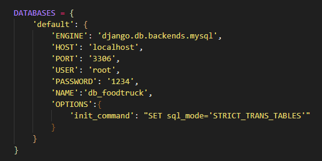

# Correr el backend en modo local

## Requisitos Previos
- Instalar Python >= 3.0
    - Descarga Python: https://www.python.org/downloads/
   
- Instalar virtualenv >= 20.25.0 [Para usar entornos virtuales en python]
    - Ejecuta el siguiente comando en una terminal para instalarlo: **pip install virtualenv**
   
- Instalar MySQL Workbench >= 8.0
    - Descarga MySQL Workbench: https://dev.mysql.com/downloads/workbench/

## Correr Servidor Backend en Local Host
- Clonar este repositorio en tu PC
    - Usando Git: **git clone https://github.com/osvid98/Foodtruck-Zacatenco-Movil-Backend.git**
    - Puedes usar Github Desktop si lo tuyo no son los comandos: https://desktop.github.com
   
- Crea una nueva base de datos en MySQL con el nombre "db_foodtruck" y usarla
   - Para mayor facilidad correr el script "db_foodtruck.sql" en Workbench que se encuentra en la carpeta "DataBase"
   
- Si requieres configurar el puerto del modo local o la contraseña de tu database, accede a: Proyecto_API/Proyecto_API/settings.py y en la variable DATABASES puedes configurar: 
   
- Ejecutar el .bat llamado "localhost.bat"
   
- Ejecutar el servidor local
   - Usar: **python manage.py runserver**
   - Verifica tu modo local en tu navegador (comunmente es http://127.0.0.1:8000/)

